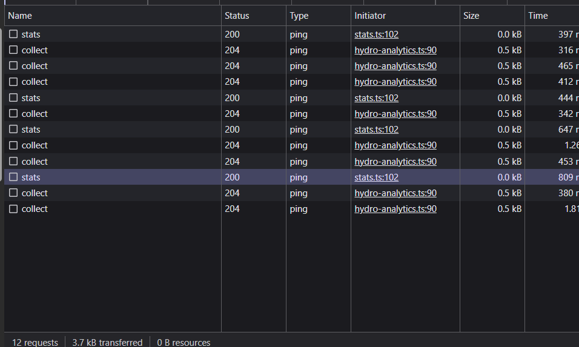

so the network tab in the dev tools is basically a network monitor, which tracks and logs the requests and responses - just like the system in library where we enter our roll numbers while entering and exiting - basically which monitors who is entering and exiting the library... or the watchman at NITK gate who maintains record of every vehicle that comes into the campus

the requests and responses are basically the scripts, css, images, and API requests

1. HTTP vs HTTPS comparision:

 - neverSSL
 - github
 - youtube

The trivial difference in the request headers of HTTP and HTTPS is that HTTP transmits the request in plain text without any encryption whereas the HTTPS uses TSL/SSL encryption
This is similar to sending a letter containing confidential information to a person, where the employees at post office can easily read and access the information... whereas in HTTPS sites, the text in the letter is encrypted.
As HTTP does not have any encryption, that means that any third party could access the traffic in the network... making HTTPS more secure that HTTP
simply put, http becomes http when the letter (requests) are encrypted with some sort of manipulation of the text so that no one can understand it...

2. Request Analysis:

NeverSSL being a simple website just made two requests - one for the favicon and one is at the beginning to get the website itself

both github and youtube have a lot of requests...
key notice - Youtube shows too many requests while playing a video than that of home page - similar to github which shows many requests while a repo is open that in the login/signup page.
simple explanation - more the data required, more requests will be made - the number of requests made is not related to the encryption of the site itself but on the amount of data required.

the requests sent for the NeverSSL was mainly just one icon after the DOM was loaded, but for github(36) and youtube(144), requests were made to fetch data from the servers...
Youtube made the most number of requests(during video streaming) as it loads only required amount of data every time(that is, it doesnt load or download whole video at once but only for the next 10 seconds - this is crucial for fast downloading and changing of video formats during the playback)

3. Performance Analysis:

Total Load time: (indicated in the bottom part of the network tab 'Finish')
youtube - 9.67s
neverssl - 2.05s
github - 9.68s

the requests that took the most time:
Github - collect - 1.34s
Youtube - video playback - 2.28s 
neverssl - online/ - 1.98s

this request is that of the assignment repo named collect:
DNS Lookup - time spent translating the human readable adress to machine understandable language (IP address)
Connection time - time spent establishing a stable reliable network connection with server at resolve IP address - this is the time spent to establish connection with server after the DNS Lookup is over
Waiting (TTFB - time to first byte) - time spent waiting for the server to send first byte of data

Analogy (just a try, idk it might be a bit vague) - customer reading the menu and giving order to the waiter (DNS Lookup), Connection time - time spent by the waiter to tell the chef. Waiting - time taken for the  first dish to arrive