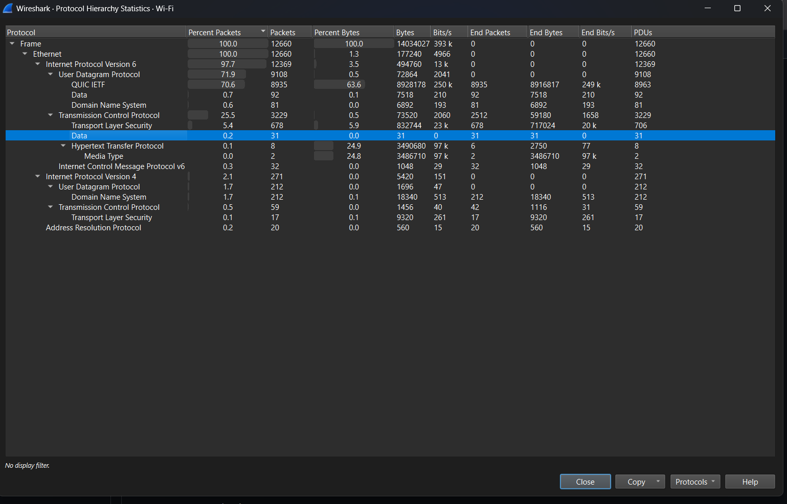
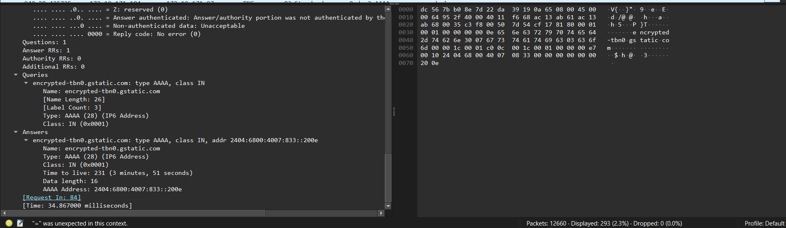
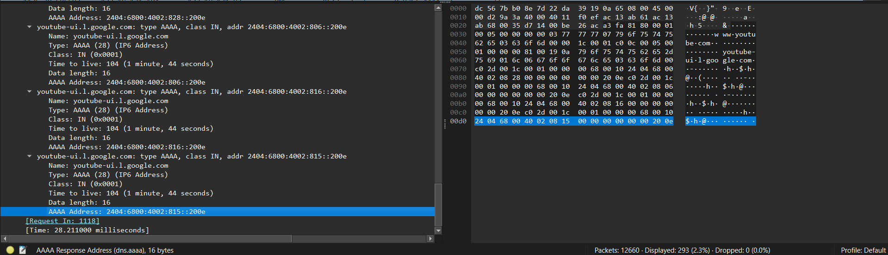
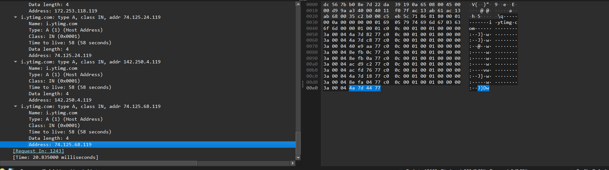
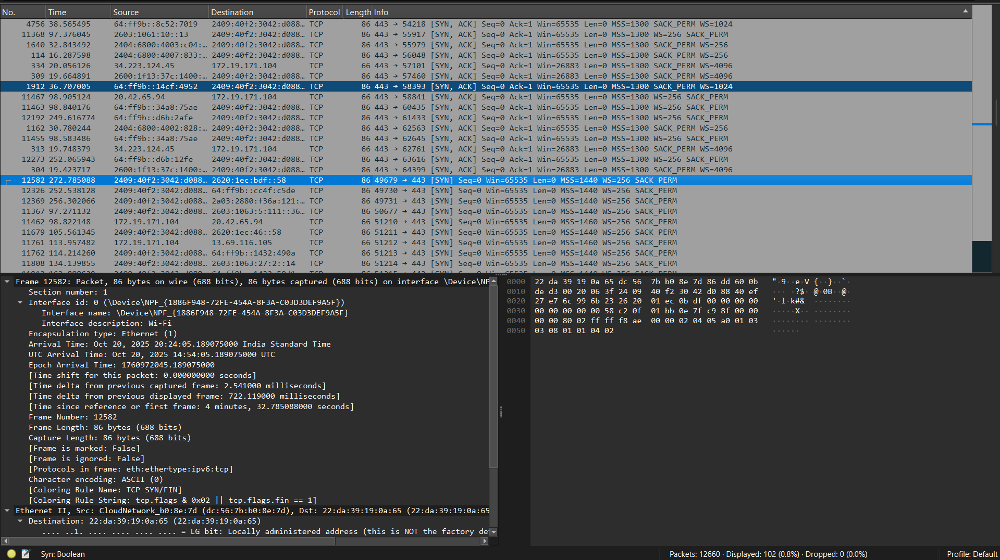
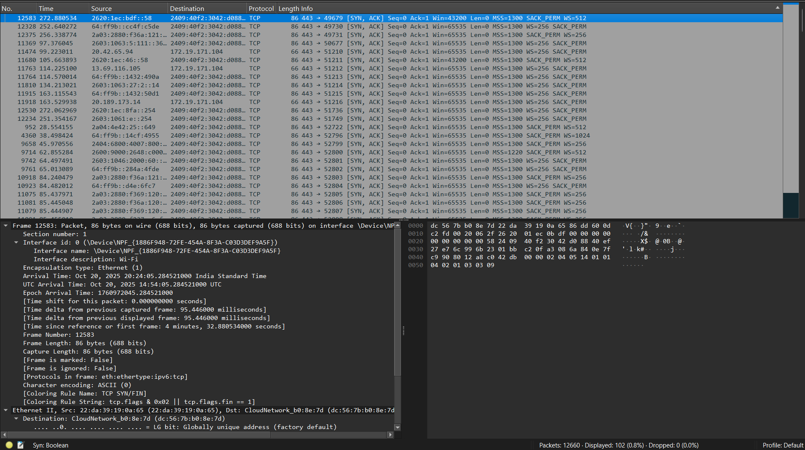
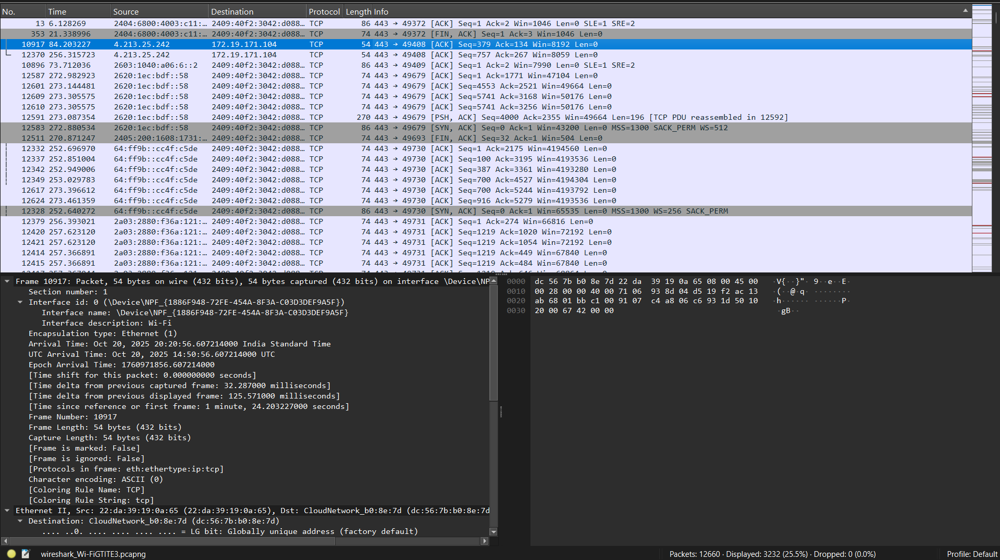
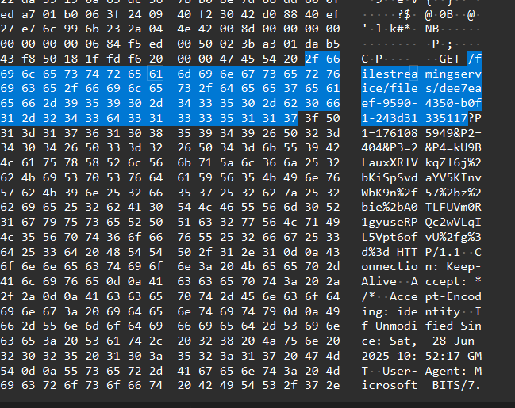
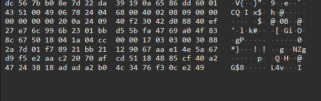

1. Protocol distribution

Top 5 protocols:
1) QUIC IETF - 70.6% - this is a faster and secure version of TCP- prevents HOL blocking, basically divides the data into sets(streams), so that loss of one packet only affects the corresponding stream and not the entire data pack - secured by TLS.

2) Transport Layer Security - 5.4% - the thing that creates difference in http and https (basically the S in https) - its a cryptographic protocol which provides end to end encryption. basically in the letter analogy, it is the set of rules that define the process of encryption... (for eg, every letter is shifted by 3 => A becomes D and so on...)

3) Domain Name System (Internet Protocol Version 4) - 1.7% - often refferred to as internet's phone book, basically translating the data to ip adress which the machine can read

4) Data (Internet Protocol Version 6) - 0.7% - provides a mechanism of data transfer, from one device to another

5) Domain Name System (Internet Protocol Version 6) - 0.6% - same thing as point 3, but the difference between IPv4 and IPv6 is that IPv6 uses 128 bit address while the IPv4 uses 32 bits...

2. DNS Query Analysis

Query 1:

Domain being queried: encrypted-tbn0.gstatic.com
DNS Server IP: 172.19.171.97
DNS Response IP: 2404:6800:4007:833::200e
Response Time: 34.867000 milliseconds

Query 2:

Domain being queried: www.youtube.com
DNS Server IP: 172.19.171.104
DNS Response IP: 2404:6800:4002:815::200e
Response Time: 135.062000 milliseconds

Query 3:

Domain being queried: i.ytimg.com
DNS Server IP: 172.19.171.104
DNS Response IP: 74.125.68.119
Response Time: 20.835000 milliseconds

3. TCP three way handshake
SYN:

SYN, ACK:

ACK:

SYN(chronize) - used to initiate a connection, sent by the client
SYN(chronize) ACK(nowledgement) - the server send back packets to accept the connection
ACK(nowledgement) - sent by the client again to server to confirm the connection

Analogy(soory for this, didnt find a better one!) - a boy says to girl "I love you"(SYN), she replies back "I love you too" (SYNACK) - confirmation... the boy then hugs the girl (ACK) - finalising the connection

4. HTTP vs HTTPS in packets:
HTTP: 
HTTPS: 

As we can see the data in the http packet is clearly readable contrary to the https one which is clearly encrypted...

the https one is unreadable as it is encrypted with SSL/TLS which is encryption protocol (just like A -> D and B -> E etc).