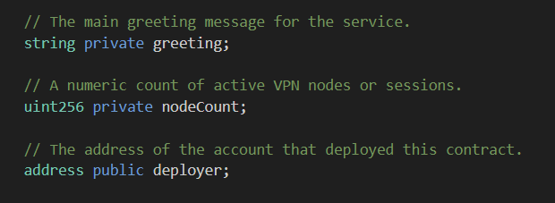

1. // contract code:
pragma solidity ^0.8.24;

contract DVPNContract {
     
    // The main greeting message for the service.
    string private greeting;

    // A numeric count of active VPN nodes or sessions.
    uint256 private nodeCount;

    // The address of the account that deployed this contract. 
    address public deployer;

    // --- Constructor ---
    // Runs only once when the contract is deployed.
    constructor() {
        // Set the deployer address to the sender of the deployment transaction.
        deployer = msg.sender;
        // Initialize state variables.
        greeting = "Welcome to the Decentralized VPN Service!";
        nodeCount = 0;
    }

    // --- Write Functions (Modify State, Cost Gas) ---

    /**
     * @notice Stores a new greeting message.
     * @param _greeting The new greeting message to store.
     */
    function setGreeting(string memory _greeting) public {
        greeting = _greeting;
    }

    /**
     * @notice Stores a new number representing the active VPN nodes.
     * @param _count The new node count.
     */
    function setNodeCount(uint256 _count) public {
        nodeCount = _count;
    }

    /**
     * @notice Returns the current greeting message.
     * @return string The current greeting.
     */
    function getGreeting() public view returns (string memory) {
        return greeting;
    }

    /**
     * @notice Returns the current number of active VPN nodes.
     * @return uint256 The current node count.
     */
    function getNodeCount() public view returns (uint256) {
        return nodeCount;
    }

    /**
     * @notice Returns the address that originally deployed this contract.
     * @return address The deployer's wallet address.
     * @dev Note: Solidity automatically creates a getter for the public 'deployer' variable,
     * but this function explicitly matches your request.
     */
    function getDeployerAddress() public view returns (address) {
        return deployer;
    }
}

2. Solidity Basics

Constructor => In C++, constructor is a function defined inside a class (usually the function name same as class name), and it runs as soon as the class is called, the constructor function doesnt need a seperate call, and automatically initiates the class - used for setting up initial values, like after declaring variables, we set them to 0 to be used further...
Just like that, in .sol files, i.e., in smart contracts, constructor is used to set up initial values, like setting the owner or initial token balance...

contract in solidity is like class in C++ (analogy)

Keywords=>
public and private: public and private are mainly related to visibility property of the functions or data in a contract, when a function is written in public area, anyone (outside the scope of the contract) can access the function or data, whereas in private area, only the contract can see and access it...

view: this is related to mutability of the data, and this means that the function promises to only read data from the blockchain and will never change any of contract's stored data...

memory: this is like temporary storage, and it stores necessary information like strings and arrays until the function stops or ends... somewhat like "int temp" in C.

msg.sender: it is a very important global variable in solidity. always holds the address of the account (or smart contract) and it tells the contract who is calling it now.

string - this is to store text data
address - for ethereum wallet address
unit256 - to store the number (the number we are guessing) - this number will be 256 bit number...

State Variable:
    A state variable is a variable whose value is permanently stored on blockchain's ledger. these variables are stored in contract storage on blockchain itself. when the computer is restarted, nothing really happens to state variables... as these state variables live on global blockchain network rather than on one's PC.

Declaration:
