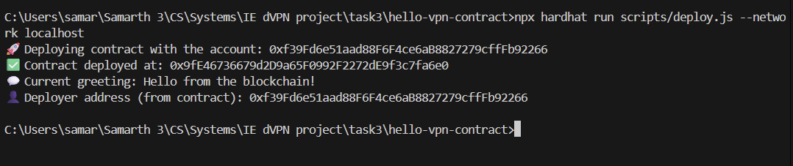
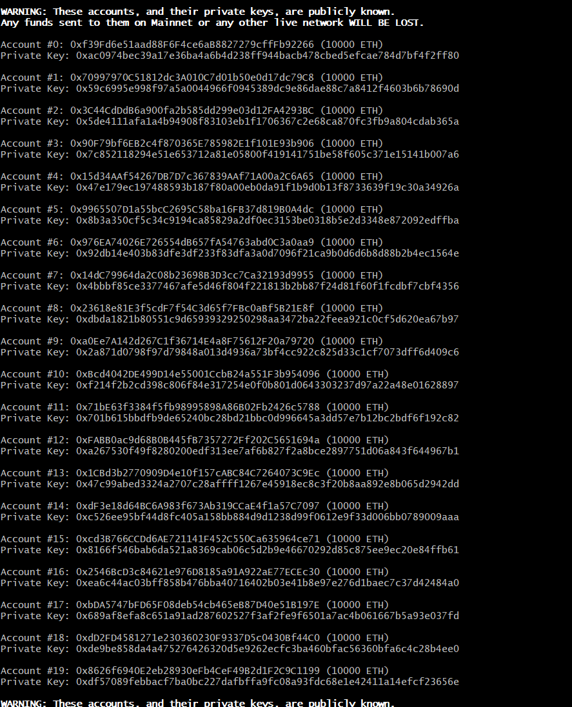
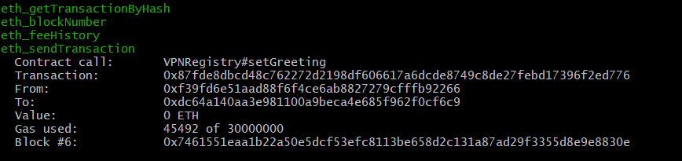
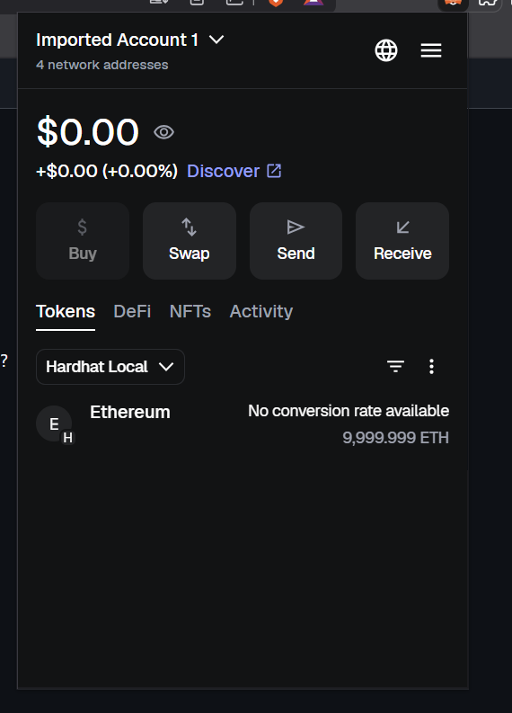
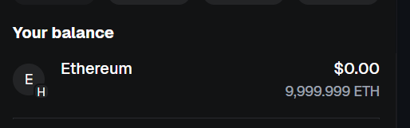
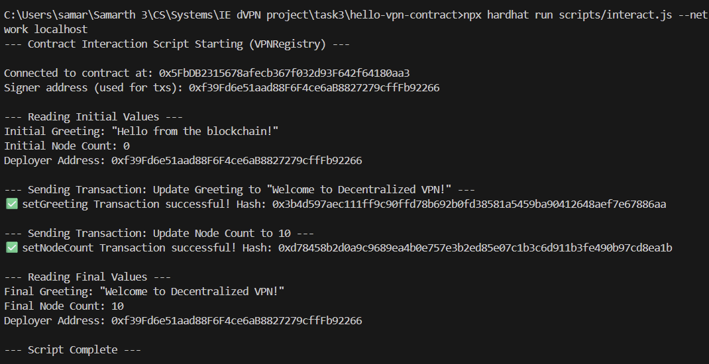
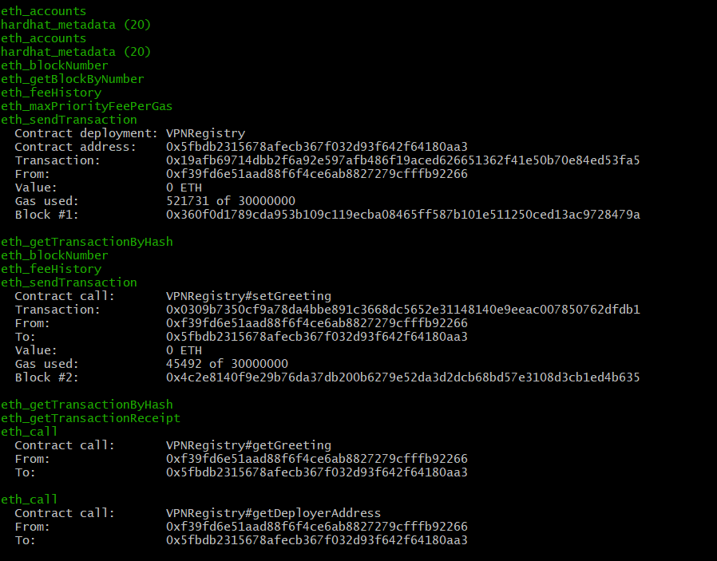
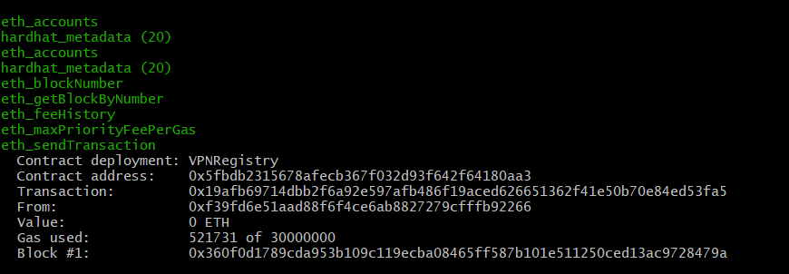

// deploy.js code:

```const { ethers } = require("hardhat");

async function main() {
  // Get the deployer (first account from Hardhat)
  const [deployer] = await ethers.getSigners();

  console.log("🚀 Deploying contract with the account:", deployer.address);

  // Deploy the VPNRegistry contract
  const VPNRegistry = await ethers.getContractFactory("VPNRegistry");
  const vpnRegistry = await VPNRegistry.deploy(); // no .deployed() in ethers v6

  console.log("✅ Contract deployed at:", vpnRegistry.target); // use .target in ethers v6

  // Set an initial greeting
  const tx = await vpnRegistry.setGreeting("Hello from the blockchain!");
  await tx.wait();

  // Retrieve values
  const greeting = await vpnRegistry.getGreeting();
  const deployerAddress = await vpnRegistry.getDeployerAddress();

  console.log("💬 Current greeting:", greeting);
  console.log("👤 Deployer address (from contract):", deployerAddress);
}

main()
  .then(() => process.exit(0))
  .catch((error) => {
    console.error("❌ Error deploying contract:", error);
    process.exit(1);
  });
```
successful deployment of deploy.js:


hardhat node terminal:


contract address is a unique location on blockchain where smart contract is present - its like an address of a house... (address of smart contract)

:

Gas is like fuel or petrol, just like how a car requires petrol to run, every operation on ethereum requires gas to do the computational work. the money for the gas is payed using Ether (ETH), and more complex the operation is, more gas it uses.

we can deploy the same contract twice, it will become like same-same but different-different, we will either way have to pay for the gas twice...

metamask:


account balance:


Test accounts have so much ETH so that they can test as much as they want, the ETH is fake and is basically worthless, only after deploying will the ETH show real value...

we can test as much as we want and ETH will be consumed, but after restarting, it will be restored back to 10k ETH.

Contract Interaction:

interact.js code:
```
// Hardhat uses the 'ethers' module globally.
const { ethers } = require("hardhat");

// Contract constants
const CONTRACT_NAME = "VPNRegistry"; 
// >>> IMPORTANT: REPLACE THIS with your actual deployed contract address on Hardhat local network <<<
const CONTRACT_ADDRESS = "0xf39Fd6e51aad88F6F4ce6aB8827279cffFb92266"; 

async function main() {
    console.log("--- Contract Interaction Script Starting (VPNRegistry) ---");

    // 1. Connect to the deployed contract
    
    // Get the default signer (the account that will pay for transactions)
    const [signer] = await ethers.getSigners();
    
    // Get the ContractFactory for VPNRegistry
    const VPNRegistryFactory = await ethers.getContractFactory(CONTRACT_NAME);

    // Attach the signer to the deployed contract address
    const contract = VPNRegistryFactory.attach(CONTRACT_ADDRESS);

    console.log(`\nConnected to contract at: ${contract.target}`);
    console.log(`Signer address (used for txs): ${signer.address}`);

    // 2. Reads current greeting and node count
    console.log("\n--- Reading Initial Values ---");
    let currentGreeting = await contract.getGreeting();
    console.log(`Initial Greeting: "${currentGreeting}"`);
    let currentNodeCount = await contract.getNodeCount();
    console.log(`Initial Node Count: ${currentNodeCount.toString()}`);
    let deployerAddress = await contract.getDeployerAddress();
    console.log(`Deployer Address: ${deployerAddress}`);

    // 3. Updates greeting to "Welcome to Decentralized VPN!"
    const newGreeting = "Welcome to Decentralized VPN!";
    console.log(`\n--- Sending Transaction: Update Greeting to "${newGreeting}" ---`);
    let tx = await contract.setGreeting(newGreeting);
    // Wait for the transaction to be mined on the Hardhat node
    await tx.wait();
    console.log(`✅ setGreeting Transaction successful! Hash: ${tx.hash}`);

    // 4. Updates node count to 10
    const newNodeCount = 10;
    console.log(`\n--- Sending Transaction: Update Node Count to ${newNodeCount} ---`);
    tx = await contract.setNodeCount(newNodeCount);
    // Wait for the transaction to be mined
    await tx.wait();
    console.log(`✅ setNodeCount Transaction successful! Hash: ${tx.hash}`);

    // 5. Read and display all final values
    console.log("\n--- Reading Final Values ---");
    
    currentGreeting = await contract.getGreeting();
    console.log(`Final Greeting: "${currentGreeting}"`);

    currentNodeCount = await contract.getNodeCount();
    console.log(`Final Node Count: ${currentNodeCount.toString()}`);
    
    deployerAddress = await contract.getDeployerAddress();
    console.log(`Deployer Address: ${deployerAddress}`);

    console.log("\n--- Script Complete ---");
}

main().catch((error) => {
    console.error(error);
    process.exitCode = 1;
});
```
greetings screenshot:


hardhat-node screenshot:


Transaction screenshot:


From address: this is address of externally owned account that initiated and paid for the transaction
To address: contract address where transaction's payload was sent.
Gas used: amount of currency (fuel) used for the computational work.

