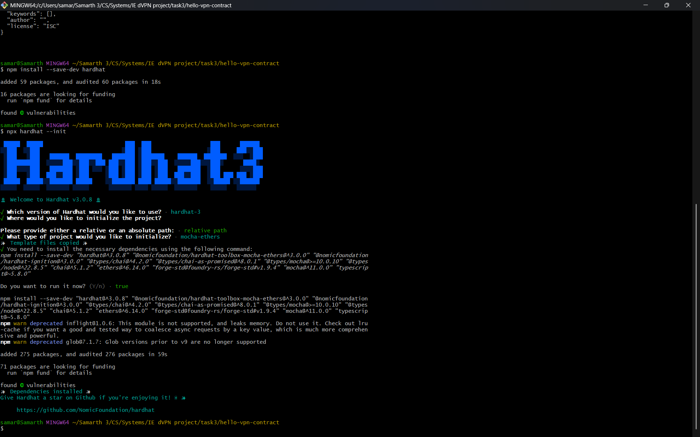
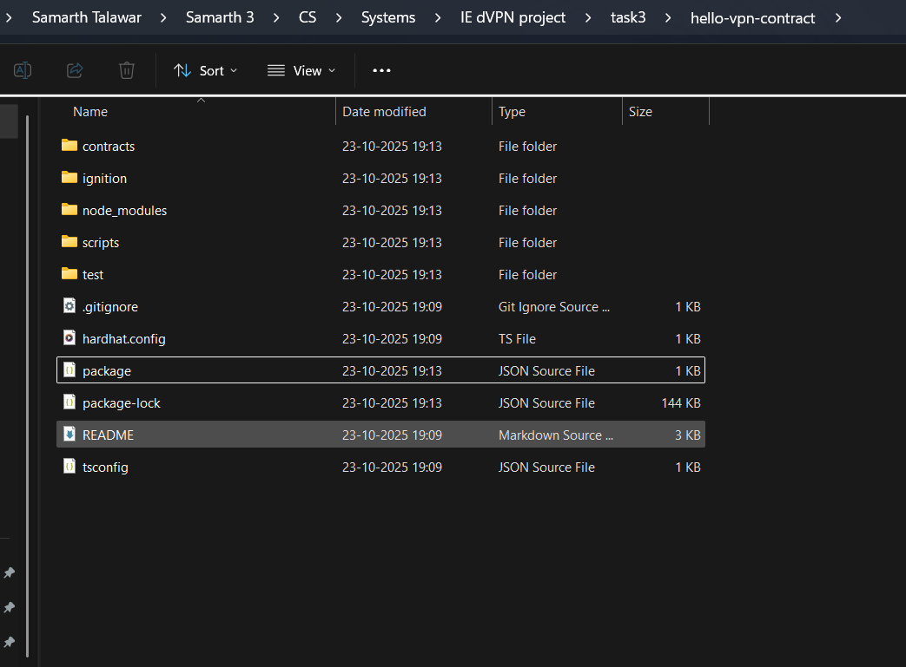

Hardhat 3 successfully installed

All the dependencies:
@nomicfoundation/hardhat-ignition - hardhat deployment system
@nomicfoundation/hardhat-toolbox-mocha-ethers - A bundle of essential plugins, including Mocha (for testing) and Ethers (for interacting with Ethereum).
Chai - a library used to write human readable test checks
ethers - JS library used to interact with ethereum blockchain and contracts.
hardhat - ethereum development environment.
mocha - primary test runner framework.

Hardhat is like a specialised development environment for building, testing and deploying smart contracts - like how library is a environment for studying, hardhat similarly provides flexibility in developing smart contracts.

contracts/ => this is where .sol files are stored and contains core logic for decentralised app. .sol files are basically smart contract source files.
scripts/ => this folder holds javascript and typescript files, used for deploying smart contracts to local network
test/ => this is where test files are put, which contain automated tests using frameworks like mocha and chai.
hardhat.config.ts => main configuration file for the project which defines all settings and environment.