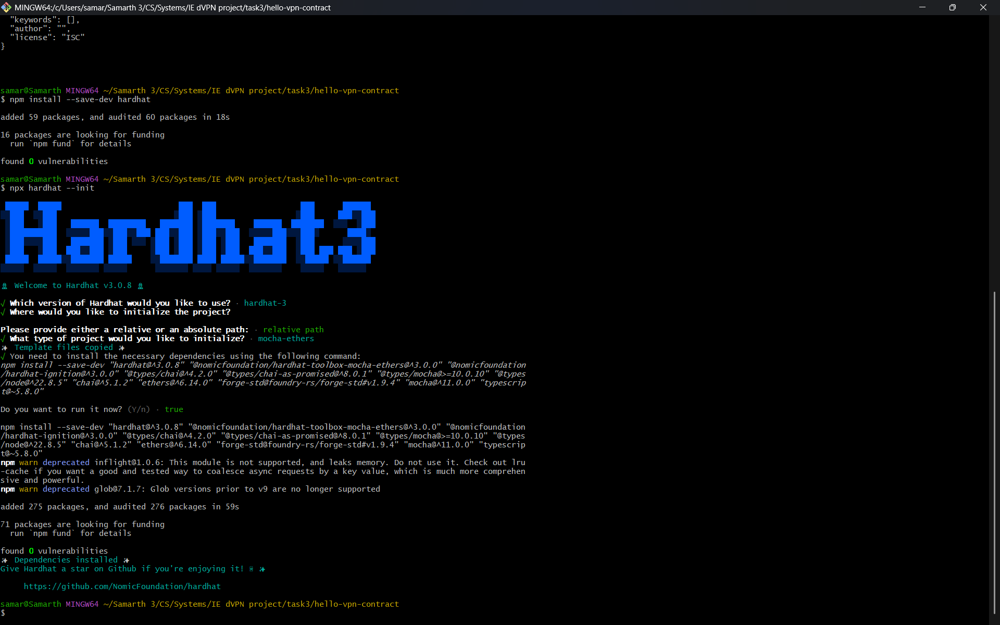
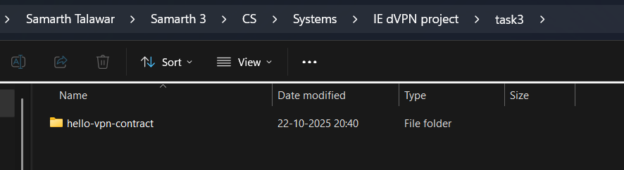
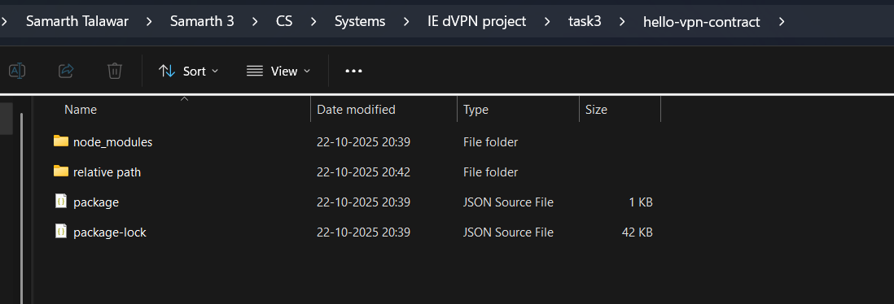

Hardhat 3 successfully installed

All the dependencies (npm list -all)

└─┬ hardhat@3.0.8
  ├─┬ @nomicfoundation/edr@0.12.0-next.7
  │ ├── @nomicfoundation/edr-darwin-arm64@0.12.0-next.7
  │ ├── @nomicfoundation/edr-darwin-x64@0.12.0-next.7
  │ ├── @nomicfoundation/edr-linux-arm64-gnu@0.12.0-next.7
  │ ├── @nomicfoundation/edr-linux-arm64-musl@0.12.0-next.7
  │ ├── @nomicfoundation/edr-linux-x64-gnu@0.12.0-next.7
  │ ├── @nomicfoundation/edr-linux-x64-musl@0.12.0-next.7
  │ └── @nomicfoundation/edr-win32-x64-msvc@0.12.0-next.7
  ├─┬ @nomicfoundation/hardhat-errors@3.0.3
  │ └── @nomicfoundation/hardhat-utils@3.0.3 deduped
  ├─┬ @nomicfoundation/hardhat-utils@3.0.3
  │ ├─┬ @streamparser/json-node@0.0.22
  │ │ └── @streamparser/json@0.0.22
  │ ├── debug@4.4.3 deduped
  │ ├── env-paths@2.2.1
  │ ├── ethereum-cryptography@2.2.1 deduped
  │ ├── fast-equals@5.3.2
  │ ├── json-stream-stringify@3.1.6
  │ ├── rfdc@1.4.1
  │ └── undici@6.22.0
  ├─┬ @nomicfoundation/hardhat-zod-utils@3.0.1
  │ ├── @nomicfoundation/hardhat-errors@3.0.3 deduped
  │ ├── @nomicfoundation/hardhat-utils@3.0.3 deduped
  │ └── zod@3.25.76 deduped
  ├─┬ @nomicfoundation/solidity-analyzer@0.1.2
  │ ├── @nomicfoundation/solidity-analyzer-darwin-arm64@0.1.2
  │ ├── @nomicfoundation/solidity-analyzer-darwin-x64@0.1.2
  │ ├── @nomicfoundation/solidity-analyzer-linux-arm64-gnu@0.1.2
  │ ├── @nomicfoundation/solidity-analyzer-linux-arm64-musl@0.1.2
  │ ├── @nomicfoundation/solidity-analyzer-linux-x64-gnu@0.1.2
  │ ├── @nomicfoundation/solidity-analyzer-linux-x64-musl@0.1.2
  │ └── @nomicfoundation/solidity-analyzer-win32-x64-msvc@0.1.2
  ├── @sentry/core@9.46.0
  ├── adm-zip@0.4.16
  ├── chalk@5.6.2
  ├─┬ chokidar@4.0.3
  │ └── readdirp@4.1.2
  ├─┬ debug@4.4.3
  │ └── ms@2.1.3
  ├─┬ enquirer@2.4.1
  │ ├── ansi-colors@4.1.3
  │ └─┬ strip-ansi@6.0.1
  │   └── ansi-regex@5.0.1
  ├─┬ ethereum-cryptography@2.2.1
  │ ├─┬ @noble/curves@1.4.2
  │ │ └── @noble/hashes@1.4.0 deduped
  │ ├── @noble/hashes@1.4.0
  │ ├─┬ @scure/bip32@1.4.0
  │ │ ├── @noble/curves@1.4.2 deduped
  │ │ ├── @noble/hashes@1.4.0 deduped
  │ │ └── @scure/base@1.1.9
  │ └─┬ @scure/bip39@1.3.0
  │   ├── @noble/hashes@1.4.0 deduped
  │   └── @scure/base@1.1.9 deduped
  ├─┬ micro-eth-signer@0.14.0
  │ ├─┬ @noble/curves@1.8.2
  │ │ └── @noble/hashes@1.7.2 deduped
  │ ├── @noble/hashes@1.7.2
  │ └─┬ micro-packed@0.7.3
  │   └── @scure/base@1.2.6
  ├── p-map@7.0.3
  ├── resolve.exports@2.0.3
  ├── semver@7.7.3
  ├─┬ tsx@4.20.6
  │ ├─┬ esbuild@0.25.11
  │ │ ├── UNMET OPTIONAL DEPENDENCY @esbuild/aix-ppc64@0.25.11
  │ │ ├── UNMET OPTIONAL DEPENDENCY @esbuild/android-arm@0.25.11
  │ │ ├── UNMET OPTIONAL DEPENDENCY @esbuild/android-arm64@0.25.11
  │ │ ├── UNMET OPTIONAL DEPENDENCY @esbuild/android-x64@0.25.11
  │ │ ├── UNMET OPTIONAL DEPENDENCY @esbuild/darwin-arm64@0.25.11
  │ │ ├── UNMET OPTIONAL DEPENDENCY @esbuild/darwin-x64@0.25.11
  │ │ ├── UNMET OPTIONAL DEPENDENCY @esbuild/freebsd-arm64@0.25.11
  │ │ ├── UNMET OPTIONAL DEPENDENCY @esbuild/freebsd-x64@0.25.11
  │ │ ├── UNMET OPTIONAL DEPENDENCY @esbuild/linux-arm@0.25.11
  │ │ ├── UNMET OPTIONAL DEPENDENCY @esbuild/linux-arm64@0.25.11
  │ │ ├── UNMET OPTIONAL DEPENDENCY @esbuild/linux-ia32@0.25.11
  │ │ ├── UNMET OPTIONAL DEPENDENCY @esbuild/linux-loong64@0.25.11
  │ │ ├── UNMET OPTIONAL DEPENDENCY @esbuild/linux-mips64el@0.25.11
  │ │ ├── UNMET OPTIONAL DEPENDENCY @esbuild/linux-ppc64@0.25.11
  │ │ ├── UNMET OPTIONAL DEPENDENCY @esbuild/linux-riscv64@0.25.11
  │ │ ├── UNMET OPTIONAL DEPENDENCY @esbuild/linux-s390x@0.25.11
  │ │ ├── UNMET OPTIONAL DEPENDENCY @esbuild/linux-x64@0.25.11
  │ │ ├── UNMET OPTIONAL DEPENDENCY @esbuild/netbsd-arm64@0.25.11
  │ │ ├── UNMET OPTIONAL DEPENDENCY @esbuild/netbsd-x64@0.25.11
  │ │ ├── UNMET OPTIONAL DEPENDENCY @esbuild/openbsd-arm64@0.25.11
  │ │ ├── UNMET OPTIONAL DEPENDENCY @esbuild/openbsd-x64@0.25.11
  │ │ ├── UNMET OPTIONAL DEPENDENCY @esbuild/openharmony-arm64@0.25.11
  │ │ ├── UNMET OPTIONAL DEPENDENCY @esbuild/sunos-x64@0.25.11
  │ │ ├── UNMET OPTIONAL DEPENDENCY @esbuild/win32-arm64@0.25.11
  │ │ ├── UNMET OPTIONAL DEPENDENCY @esbuild/win32-ia32@0.25.11
  │ │ └── @esbuild/win32-x64@0.25.11
  │ ├── UNMET OPTIONAL DEPENDENCY fsevents@~2.3.3
  │ └─┬ get-tsconfig@4.13.0
  │   └── resolve-pkg-maps@1.0.0
  ├─┬ ws@8.18.3
  │ ├── UNMET OPTIONAL DEPENDENCY bufferutil@^4.0.1
  │ └── UNMET OPTIONAL DEPENDENCY utf-8-validate@>=5.0.2
  └── zod@3.25.76

 -> 

Hardhat is like a specialised development environment fopr building, testing and deploying smart contracts - like how library is a environment for studying, hardhat similarly provides flexibility in developing smart contracts.

contracts/ => this is where .sol files are stored and contains core logic for decentralised app. .sol files are basically smart contract source files.
scripts/ => this folder holds javascript and typescript files, used for deploying smart contracts to local network
test/ => this is where test files are put, which contain automated tests using frameworks like mocha and chai.
hardhat.config.ts => main configuration file for the project which defines all settings and environment.