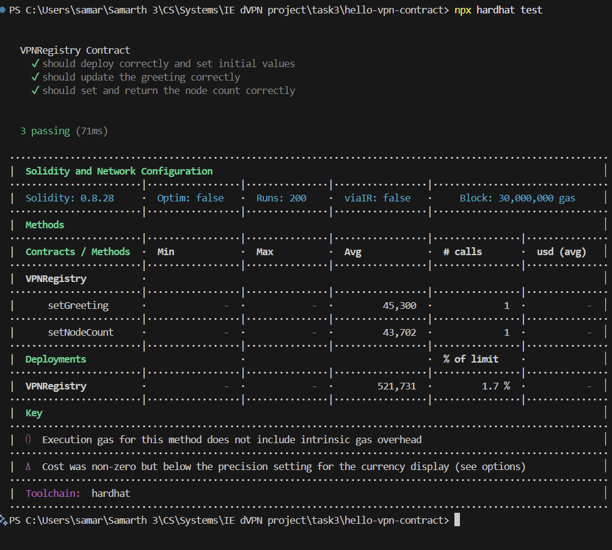
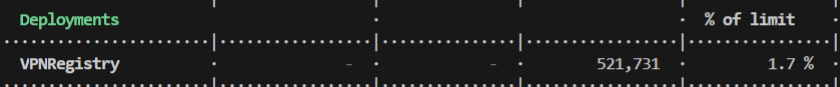

Green checkmarks:


test code:
```const { expect } = require("chai");

describe("VPNRegistry Contract", function () {
  let VPNRegistry, vpnRegistry, owner;

  beforeEach(async function () {
  VPNRegistry = await ethers.getContractFactory("VPNRegistry");
  [owner] = await ethers.getSigners();
  vpnRegistry = await VPNRegistry.deploy(); // Deploys the contract

});

  // Test 1: Deploy contract and check initial values
  it("should deploy correctly and set initial values", async function () {
    const deployerAddress = await vpnRegistry.getDeployerAddress();
    const initialGreeting = await vpnRegistry.getGreeting();
    const initialNodeCount = await vpnRegistry.getNodeCount();

    expect(deployerAddress).to.equal(owner.address);
    expect(initialGreeting).to.equal("");
    expect(initialNodeCount).to.equal(0);
  });

  // Test 2: Update greeting and verify it changed
  it("should update the greeting correctly", async function () {
    await vpnRegistry.setGreeting("Hello VPN!");
    const greeting = await vpnRegistry.getGreeting();
    expect(greeting).to.equal("Hello VPN!");
  });

  // Test 3: Set node count and retrieve it
  it("should set and return the node count correctly", async function () {
    await vpnRegistry.setNodeCount(42);
    const count = await vpnRegistry.getNodeCount();
    expect(count).to.equal(42);
  });
});
```
2. Basic Understanding:

testing of smart contracts is done so that we can be sure they work properly, as it is not possible afterwards to change them... and it takes money (gas) to deploy them...

expect(greeting).to.equal("Hello VPN");
this line checks whether variable greeting has the value "Hello VPN", the test passes if it is true and fails if it is false

:
the amount of gas used while deploying VPN registry.

Gas is like fuel or petrol, just like how a car requires petrol to run, every operation on ethereum requires gas to do the computational work. the money for the gas is payed using Ether (ETH), and more complex the operation is, more gas it uses.